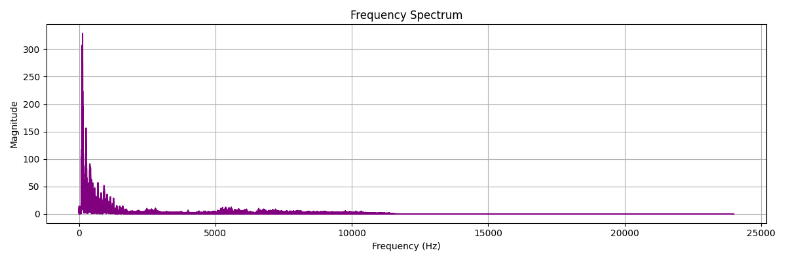
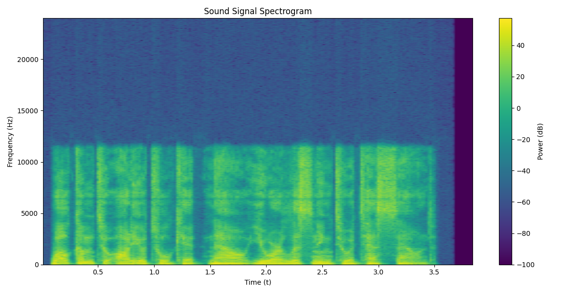
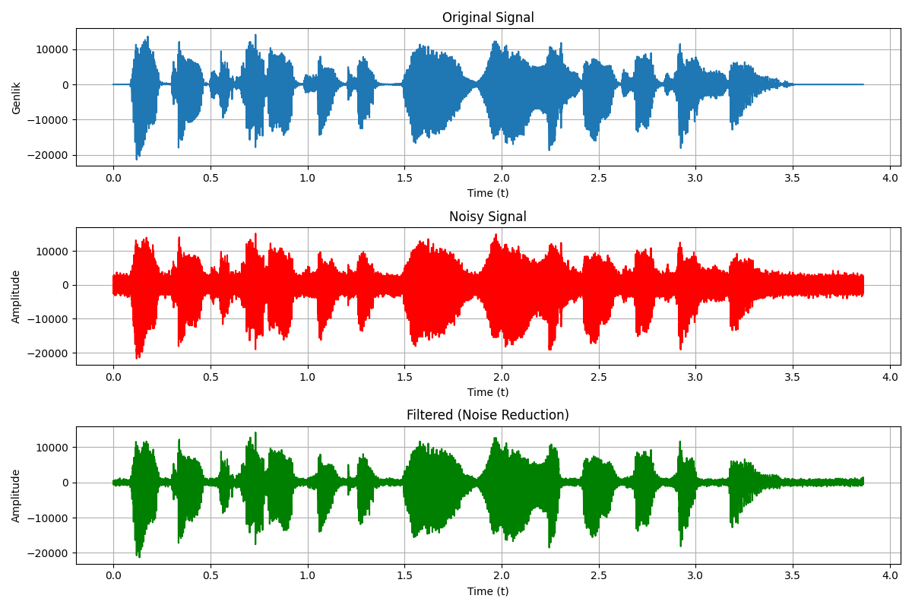

# 🎶 Audio Signal Processing Toolkit

Ses sinyalleri üzerinde temel sinyal işleme uygulamaları.  
Bu repo, zaman ve frekans analizini, filtrelemeyi, spectrogram üretmeyi ve gürültü azaltmayı içerir.  

## 🚀 İçerik
- **waveform_fft.py** → Ses dalga formu + Fourier spektrumu  
- **filtering.py** → Low-pass, High-pass, Band-pass filtre uygulamaları  
- **spectrogram.py** → Zaman–frekans analizi (STFT, spectrogram)  
- **noise_reduction.py** → Gürültü ekleme ve filtre ile temizleme  

## 📂 Proje Yapısı
```
audio-toolkit/
├── src/
│ ├── waveform_fft.py
│ ├── filtering.py
│ ├── spectrogram.py
│ └── noise_reduction.py
├── data/
│ └── toolkit.wav # örnek ses dosyası
├── README.md
└── requirements.txt
```
## 📦 Kurulum
```bash
git clone https://github.com/kullanici_adi/audio-toolkit.git
cd audio-toolkit
pip install -r requirements.txt
```

## ▶️ Kullanım
Her script grafik üretir. data/ klasörüne kendi .wav dosyanızı koyarak çalıştırabilirsiniz.

```bash
python src/waveform_fft.py
python src/filtering.py
python src/spectrogram.py
python src/noise_reduction.py
```

## 📝 Notlar
Örnekleme Frekansı (fs): Sesin çözünürlüğünü belirler.
Cutoff Frekansı: Filtrenin geçirdiği/bastırdığı frekans sınırı.
STFT (Short-Time Fourier Transform): Sinyali kısa pencerelerle Fourier’e ayırarak zaman–frekans bilgisi verir.
Noise Reduction: Gürültü eklenmiş sinyali filtreyle temizleme örneği.

## 📊 Örnek Çıktılar
**Dalga Formu + Fourier Spektrumu**  


**Filtreleme Sonuçları**  


**Spectrogram**  


**Noise Reduction**  
