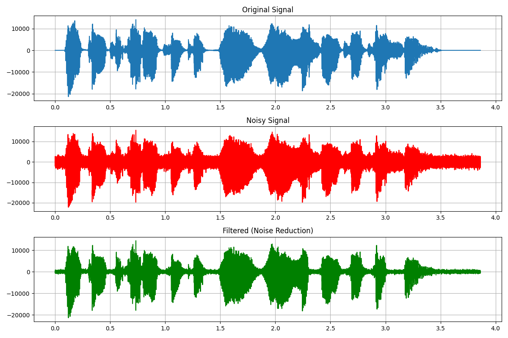

# 🎶 Audio Signal Processing Toolkit
```
Basic signal processing applications on audio signals.  
This repository covers time- and frequency-domain analysis, filtering, spectrogram generation, and noise reduction.  
```

## 🚀 Contents
- **main.py**            → Entry point for running all modules
- **waveform_fft.py**    → Audio waveform + Fourier spectrum  
- **filtering.py**       → Low-pass, High-pass, Band-pass filter implementations  
- **spectrogram.py**     → Time–frequency analysis (STFT, spectrogram)  
- **noise_reduction.py** → Noise addition and cleaning with filters 

## 📂 Project Structure
```
audio-toolkit/
├── main.py
├── src/
│   ├── __init__.py
│   ├── waveform_fft.py
│   ├── filtering.py
│   ├── spectrogram.py
│   └── noise_reduction.py
├── data/
│   └── toolkit.wav   # sample audio file
├── images/           # generated outputs
│   ├── waveform_fft.png
│   ├── filtering.png
│   ├── spectrogram.png
│   └── noise_reduction.png
├── README.md
└── requirements.txt

```
## 📦 Installation
```bash
git clone https://github.com/your_username/audio-toolkit.git
cd audio-toolkit
pip install -r requirements.txt
```

## ▶️ Usage
Now all functionality is accessible through main.py:

```bash
# Waveform + Fourier Spectrum
python main.py fft

# Filtering (Low-pass, High-pass, Band-pass)
python main.py filter

# Spectrogram (STFT)
python main.py spectrogram

# Noise Reduction
python main.py noise

```

## 📝 Notes
```
- Sampling Frequency (fs): Defines the resolution of the audio signal.
- Cutoff Frequency: Determines the pass/stop frequency limits of a filter.
- STFT (Short-Time Fourier Transform): Splits the signal into short windows and applies Fourier transform for time–frequency information.
- Noise Reduction: Demonstrates filtering a noisy signal to restore the clean version.
```

## 📊 Example Outputs

**Waveform + Fourier Spectrum**  


**Filtering Results**  


**Spectrogram**  


**Noise Reduction**  


## 📜 License
This project is licensed under the **MIT License**.  
See the [LICENSE](LICENSE) file for details.